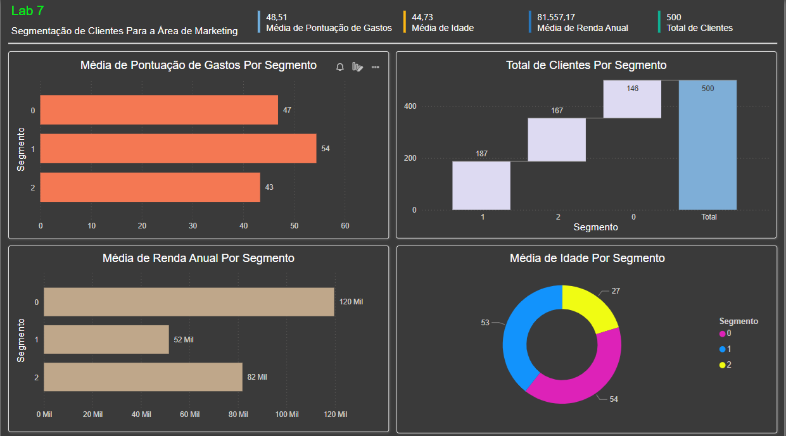

# Projeto de Segmentação de Clientes com PowerBI

Este é um projeto desenvolvido durante o curso de PowerBI da DSA. O objetivo do projeto é utilizar o algoritmo K-means para construir um modelo de Machine Learning para segmentação de clientes e, em seguida, integrar esses resultados a um dashboard no PowerBI.

## Descrição do Projeto

O projeto consiste em seguir as etapas a seguir:

1. Coleta de Dados: Realizar a coleta dos dados relevantes para a segmentação de clientes.
2. Pré-processamento de Dados: Realizar a limpeza e transformação dos dados para prepará-los para o modelo de Machine Learning.
3. Construção do Modelo de Machine Learning: Utilizar o algoritmo K-means para segmentar os clientes em grupos com características semelhantes.
4. Integração com o PowerBI: Importar os resultados da segmentação para o PowerBI e criar um dashboard interativo para visualização dos dados.

## Estrutura do Projeto

O projeto está organizado da seguinte forma:

```
├── data/
│   ├── clientes.csv
│   └── ...
├── notebooks/
│   ├── pre_processamento.ipynb
│   ├── modelo_ml.ipynb
│   └── ...
├── dashboard.pbix
└── readme.md
```

- A pasta `data` contém os arquivos de dados utilizados no projeto.
- A pasta `notebooks` contém os notebooks Jupyter utilizados para o pré-processamento dos dados e construção do modelo de Machine Learning.
- O arquivo `dashboard.pbix` é o arquivo do PowerBI contendo o dashboard final.
- O arquivo `readme.md` é este arquivo, contendo informações sobre o projeto.

## Como Executar o Projeto

Para executar o projeto, siga as etapas abaixo:

1. Clone este repositório para o seu ambiente local.
2. Importe os arquivos de dados localizados na pasta `data` para o seu ambiente de trabalho.
3. Execute os notebooks localizados na pasta `notebooks` na ordem adequada para realizar o pré-processamento dos dados e construção do modelo de Machine Learning.
4. Abra o arquivo `dashboard.pbix` no PowerBI para visualizar o dashboard final.

## Print do Dashboard


